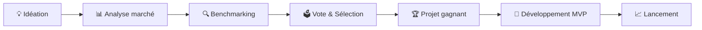

# 🚀 Start-up IA -

<div align="center">


### 🎓 Projet Start-up innovante avec IA - Promo B2 Temps Plein

**Révolutionner un secteur grâce à l'Intelligence Artificielle**

[📊 Business Plan](#-business-plan) • [🔍 Benchmarks](#-benchmarks) • [🎯 Classement Projets](#-classement-des-projets) • [� Projet Final](#-projet-final)

</div>

---

## 📋 Table des matières

```
📁 Start-up IA - B2TP
├── 📖 Vue d'ensemble
├── 🎯 Objectifs du projet
├── 🏆 Classement des 3 projets
│   ├── ⭐⭐⭐ Plateforme d'apprentissage IA
│   ├── ⭐⭐   SaaS automation stocks
│   └── ⭐     IA devis & visuel BTP
├── 📊 Business Plan & Système de vote
├── 🔍 Benchmarks & Analyse de marché
├── 💡 Projet Final sélectionné
└── 👥 Équipe & Contact
```

---

## 🌟 Vue d'ensemble

Ce projet académique de la **promo B2TP** vise à créer une **start-up innovante** qui révolutionne un secteur en intégrant l'Intelligence Artificielle. Notre approche se concentre sur trois piliers fondamentaux :

<table>
<tr>
<td align="center" width="33%">

### 💰 Rentabilité sur 10 ans
Projection économique long terme
Viabilité et croissance du marché

</td>
<td align="center" width="33%">

### 🌍 Impact Bien Commun
Contribution sociale positive
Accessibilité et amélioration collective

</td>
<td align="center" width="33%">

### ⚡ Efficacité
Optimisation par l'IA
Innovation et disruption sectorielle

</td>
</tr>
</table>

---

## 🏆 Classement des projets

### 📊 Tableau récapitulatif

<div align="center">

| 🥇 Rang | 💡 Idée | 📈 Marché / Croissance | 🌍 Impact Social | ⭐ Priorité |
|:-------:|---------|------------------------|------------------|:----------:|
| **1** | **🎓 Plateforme d'apprentissage IA** | Très gros marché ed-tech<br/>Forte croissance (**~13% CAGR**) | **Très élevé** | ⭐⭐⭐ |
| **2** | **📦 SaaS automation stocks** | Marché modéré<br/>Croissance (~7-8%) | Élevé/Modéré | ⭐⭐ |
| **3** | **🏗️ IA devis & visuel BTP** | Marché plus petit<br/>Croissance plus lente | Modéré | ⭐ |

</div>

---

## 💡 Détail des 3 projets

### 🥇 #1 - Plateforme d'apprentissage IA (⭐⭐⭐)

<details open>
<summary><b>Cliquez pour voir les détails</b></summary>

#### 🎯 Concept
Plateforme éducative révolutionnaire utilisant l'IA pour personnaliser l'apprentissage et maximiser l'efficacité pédagogique.

#### 📊 Indicateurs clés
- **Marché** : Ed-tech mondial valorisé à 340+ milliards $ (2023)
- **Croissance** : 13% CAGR (2023-2030)
- **Impact social** : Démocratisation de l'éducation de qualité
- **Rentabilité 10 ans** : Modèle SaaS récurrent, forte scalabilité

#### 🚀 Avantages compétitifs
- ✅ Marché en forte croissance
- ✅ Impact social très élevé
- ✅ Scalabilité internationale
- ✅ Récurrence des revenus (abonnements)

> 📄 **[Plus de détails →](./docs/PLATEFORME_APPRENTISSAGE_IA.md)**

</details>

---

### 🥈 #2 - SaaS automation stocks (⭐⭐)

<details>
<summary><b>Cliquez pour voir les détails</b></summary>

#### 🎯 Concept
Solution SaaS d'automatisation et d'optimisation de gestion des stocks par IA prédictive.

#### 📊 Indicateurs clés
- **Marché** : Inventory management software (~6 milliards $)
- **Croissance** : 7-8% CAGR
- **Impact social** : Modéré (réduction gaspillage, optimisation)
- **Rentabilité 10 ans** : Modèle B2B stable

#### 🚀 Avantages compétitifs
- ✅ Besoin entreprises réel
- ✅ ROI rapide pour clients
- ✅ Marché B2B établi
- ⚠️ Concurrence établie

</details>

---

### 🥉 #3 - IA devis & visuel BTP (⭐)

<details>
<summary><b>Cliquez pour voir les détails</b></summary>

#### 🎯 Concept
Outil IA pour générer automatiquement des devis et visualisations 3D de projets BTP.

#### 📊 Indicateurs clés
- **Marché** : Construction tech (marché de niche)
- **Croissance** : Plus lente (~4-5%)
- **Impact social** : Modéré (gain de temps professionnels)
- **Rentabilité 10 ans** : B2B spécialisé

#### 🚀 Avantages compétitifs
- ✅ Niche spécialisée
- ✅ Peu de concurrence directe
- ⚠️ Marché plus restreint
- ⚠️ Adoption plus lente

</details>

---

## 🎯 Objectifs du projet B2TP

### Vision : Sélectionner et développer LA start-up innovante



### 📏 Critères de sélection et pondération

| Critère | Pondération | Description |
|---------|:-----------:|-------------|
| 💰 **Rentabilité 10 ans** | 35% | ROI, projections financières, modèle économique viable |
| 🌍 **Impact bien commun** | 30% | Contribution sociale, accessibilité, amélioration collective |
| ⚡ **Efficacité technique** | 25% | Performance IA, scalabilité, faisabilité technique |
| 🚀 **Innovation** | 10% | Originalité, disruption du marché, avantage concurrentiel |

**Formule de calcul du score :**
```
Score Total = (Rentabilité × 35%) + (Bien commun × 30%) + (Efficacité × 25%) + (Innovation × 10%)
```

---

## 📊 Business Plan

> 📄 **[Accéder au Business Plan détaillé](./docs/BUSINESS_PLAN.md)**

Le business plan analyse en profondeur chaque projet avec :

- 🎯 **Analyse de marché** : Taille, croissance, tendances
- 💵 **Projections financières sur 10 ans** : Revenus, coûts, rentabilité
- 🗳️ **Système de vote interactif** : Évaluation communautaire selon les 4 critères
- 📈 **KPIs et métriques** : Indicateurs de performance clés
- 🛡️ **Analyse SWOT** : Forces, faiblesses, opportunités, menaces
- 🎯 **Go-to-Market Strategy** : Stratégie de lancement et acquisition

### 🗳️ Système de vote

Chaque membre de la promo B2TP peut voter pour chaque projet selon les 4 critères (note sur 10) :

```
📊 Rentabilité 10 ans   : ⭐⭐⭐⭐⭐⭐⭐⭐⭐⭐ (poids 35%)
🌍 Impact bien commun   : ⭐⭐⭐⭐⭐⭐⭐⭐⭐⭐ (poids 30%)
⚡ Efficacité technique : ⭐⭐⭐⭐⭐⭐⭐⭐⭐⭐ (poids 25%)
🚀 Innovation           : ⭐⭐⭐⭐⭐⭐⭐⭐⭐⭐ (poids 10%)
```

**Le projet avec le meilleur score pondéré sera développé !**

---

## 🔍 Benchmarks

> 📄 **[Consulter les Benchmarks complets](./docs/BENCHMARKS.md)**

### Analyse comparative des 3 projets

Notre étude de marché compare :

<table>
<tr>
<th width="25%">Critère</th>
<th width="25%">� Plateforme IA</th>
<th width="25%">📦 SaaS Stocks</th>
<th width="25%">🏗️ IA BTP</th>
</tr>
<tr>
<td><b>Taille marché</b></td>
<td>340+ Mds $ �</td>
<td>~6 Mds $ 🟡</td>
<td><2 Mds $ 🟠</td>
</tr>
<tr>
<td><b>Croissance CAGR</b></td>
<td>~13% 🟢</td>
<td>~7-8% �</td>
<td>~4-5% 🟠</td>
</tr>
<tr>
<td><b>Concurrence</b></td>
<td>Élevée 🟠</td>
<td>Établie 🟠</td>
<td>Faible 🟢</td>
</tr>
<tr>
<td><b>Barrière entrée</b></td>
<td>Moyenne 🟡</td>
<td>Élevée 🟠</td>
<td>Faible 🟢</td>
</tr>
<tr>
<td><b>Time-to-market</b></td>
<td>6-12 mois 🟡</td>
<td>9-15 mois 🟠</td>
<td>4-8 mois 🟢</td>
</tr>
</table>

📊 **Légende** : 🟢 Excellent | 🟡 Bon | 🟠 Modéré

---

## 💡 Projet Final

> 📄 **[Découvrir le Projet Final sélectionné](./docs/PROJET_FINAL.md)**

### 🏆 Projet sélectionné suite au vote : **[À déterminer]**

Une fois le vote terminé, le projet gagnant sera documenté ici avec :

- ✅ **Justification du choix** : Pourquoi ce projet ?
- 🏗️ **Architecture technique** : Stack technologique, infrastructure
- 📅 **Roadmap de développement** : Phases, sprints, livrables
- 👥 **Ressources nécessaires** : Équipe, budget, outils
- 🎯 **MVP (Minimum Viable Product)** : Fonctionnalités essentielles
- 📈 **Stratégie de lancement** : Go-to-market, marketing, acquisition

---

## 🎓 Focus : Plateforme d'apprentissage IA (Projet prioritaire ⭐⭐⭐)

> 📄 **[Documentation complète de la plateforme](./docs/PLATEFORME_APPRENTISSAGE_IA.md)**

### 🚀 Vision

Créer une **plateforme éducative révolutionnaire** qui utilise l'IA pour :
- Personnaliser les parcours d'apprentissage
- Adapter le contenu au niveau de chaque apprenant
- Fournir un feedback instantané et constructif
- Maximiser l'engagement et la rétention

### 🎯 Fonctionnalités clés

<div align="center">

| 🤖 IA Générative | 📚 Contenu Adaptatif | 🎮 Gamification | 📊 Analytics |
|:---------------:|:-------------------:|:--------------:|:------------:|
| Assistant virtuel 24/7 | Parcours personnalisés | Badges & récompenses | Suivi progression |
| Génération exercices | Niveau adaptatif | Classements | Prédiction réussite |
| Correction auto | Recommandations IA | Défis collaboratifs | Insights apprenants |
| Tutorat intelligent | Multi-formats | Système de points | Rapports détaillés |

</div>

### 🛠️ Stack technologique envisagée

```javascript
const techStack = {
  "Frontend": {
    "Framework": "React / Next.js",
    "UI": "Tailwind CSS, Shadcn/ui",
    "State": "Zustand / Redux",
    "Animation": "Framer Motion"
  },
  "Backend": {
    "API": "Node.js + Express / FastAPI (Python)",
    "Database": "PostgreSQL + MongoDB",
    "Cache": "Redis",
    "Queue": "Bull / RabbitMQ"
  },
  "IA & ML": {
    "LLM": "GPT-4, Claude, Gemini",
    "Vector DB": "Pinecone / Weaviate",
    "ML": "TensorFlow / PyTorch",
    "NLP": "LangChain, LlamaIndex"
  },
  "Infrastructure": {
    "Hosting": "AWS / Vercel",
    "CI/CD": "GitHub Actions",
    "Monitoring": "Sentry, DataDog",
    "Analytics": "Mixpanel, PostHog"
  }
};
```

### 📈 Modèle économique

- **Freemium** : Fonctionnalités de base gratuites
- **Premium** : 9,99€/mois (étudiants) - 29,99€/mois (professionnels)
- **Entreprise** : Sur devis (B2B écoles, universités, formations)
- **Marketplace** : Commission sur contenus créateurs (15-20%)

---

## 🛠️ Technologies utilisées

<div align="center">


</div>

---

## 📁 Structure du projet

```
start-up-IA/
│
├── 📄 README.md                           # Ce fichier
├── 📁 docs/                               # Documentation détaillée
│   ├── 📊 BUSINESS_PLAN.md               # Plans business des 3 projets + vote
│   ├── 🔍 BENCHMARKS.md                  # Analyse comparative détaillée
│   ├── 💡 PROJET_FINAL.md                # Documentation projet sélectionné
│   ├── 🎓 PLATEFORME_APPRENTISSAGE_IA.md # Specs plateforme #1
│   ├── 📦 SAAS_AUTOMATION_STOCKS.md      # Specs projet #2
│   └── 🏗️ IA_DEVIS_VISUEL_BTP.md         # Specs projet #3
│
├── 📁 src/                                # Code source (après sélection)
│   ├── 📁 backend/                       # API et services
│   ├── 📁 frontend/                      # Interface utilisateur
│   └── 📁 ai-models/                     # Modèles IA
│
├── 📁 data/                               # Données et datasets
├── 📁 tests/                              # Tests unitaires et intégration
├── 📁 scripts/                            # Scripts utilitaires
└── 📁 prototypes/                         # POCs et prototypes

```

---

## 🎯 Prochaines étapes

### Phase 1 : Analyse et Sélection (En cours)
- [x] Identification des 3 projets innovants
- [x] Classement initial basé sur marché/croissance et impact social
- [x] Initialisation du repository
- [ ] Compléter le business plan détaillé pour chaque projet
- [ ] Effectuer les benchmarks approfondis
- [ ] Organiser le vote B2TP selon les 4 critères
- [ ] Annoncer le projet gagnant

### Phase 2 : Conception (À venir)
- [ ] Définir l'architecture technique détaillée
- [ ] Créer les wireframes et maquettes UI/UX
- [ ] Établir la roadmap de développement
- [ ] Constituer l'équipe de développement
- [ ] Identifier les ressources et le budget

### Phase 3 : Développement MVP (À venir)
- [ ] Setup de l'environnement de développement
- [ ] Développement des fonctionnalités core
- [ ] Intégration des modèles IA
- [ ] Tests et itérations
- [ ] Documentation technique

### Phase 4 : Lancement (À venir)
- [ ] Beta testing avec premiers utilisateurs
- [ ] Corrections et optimisations
- [ ] Stratégie marketing et communication
- [ ] Lancement officiel
- [ ] Suivi des KPIs et amélioration continue

---

## 👥 Équipe & Contribution

### 🎓 Promo B2TP

Ce projet est développé dans le cadre du programme **B2 Temps Plein** de notre école.

### Comment contribuer ?

1. 🍴 **Fork** le projet
2. 🌿 Créez votre branche (`git checkout -b feature/AmazingFeature`)
3. 💾 Commit vos changements (`git commit -m 'Add some AmazingFeature'`)
4. 📤 Push vers la branche (`git push origin feature/AmazingFeature`)
5. 🎉 Ouvrez une **Pull Request**

### 🗳️ Participer au vote

**Membres de la promo B2TP** : Consultez le [Business Plan](./docs/BUSINESS_PLAN.md) pour voter et noter chaque projet selon les 4 critères !

---

## 📞 Contact

- 📧 Email: b2tp@startup-ia.com
- 🐙 GitHub: [@oussama-filali](https://github.com/oussama-filali)
- 📱 Discord: [Serveur B2TP]
- 🌐 Website: [En construction]

---

<div align="center">

### 🌟 Star ce projet si vous le trouvez utile !

[](https://github.com/oussama-filali/start-up-IA)
[](https://github.com/oussama-filali/start-up-IA/fork)

---

**Fait avec ❤️ par la promo B2TP pour révolutionner un secteur avec l'IA**

*"L'éducation est l'arme la plus puissante pour changer le monde" - Nelson Mandela*

[⬆ Retour en haut](#-start-up-ia---b2tp-innovation)

</div>

