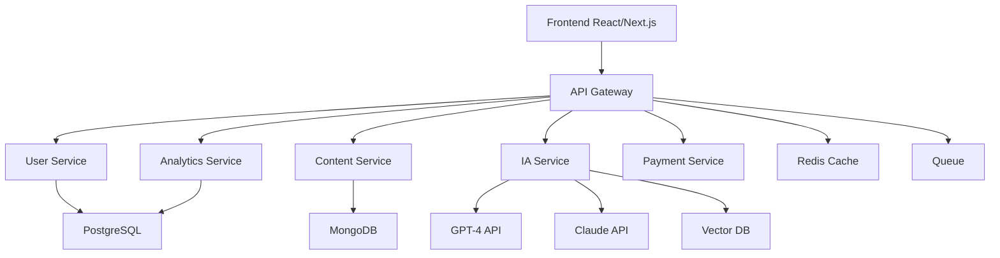

# 🎓 Plateforme d'apprentissage IA - Spécifications détaillées

[⬅ Retour au README](../README.md) | [📊 Business Plan](./BUSINESS_PLAN.md) | [🔍 Benchmarks](./BENCHMARKS.md)

---

<div align="center">


### 🚀 Révolutionner l'apprentissage grâce à l'Intelligence Artificielle

</div>

---

## 📋 Table des matières

1. [Vision et mission](#-vision-et-mission)
2. [Proposition de valeur](#-proposition-de-valeur)
3. [Personas cibles](#-personas-cibles)
4. [Fonctionnalités détaillées](#-fonctionnalités-détaillées)
5. [Architecture technique](#-architecture-technique)
6. [Modèle économique](#-modèle-économique)
7. [Roadmap de développement](#-roadmap-de-développement)
8. [Go-to-Market Strategy](#-go-to-market-strategy)
9. [Métriques de succès (KPIs)](#-métriques-de-succès-kpis)
10. [Risques et mitigation](#-risques-et-mitigation)

---

## 🎯 Vision et mission

### Vision
> Devenir la plateforme éducative de référence mondiale en combinant l'intelligence artificielle et la pédagogie pour offrir une expérience d'apprentissage personnalisée, engageante et accessible à tous.

### Mission
- 🌍 **Démocratiser l'éducation de qualité** : Rendre l'apprentissage accessible partout, tout le temps
- 🤖 **Personnaliser l'expérience** : Adapter chaque contenu au niveau et au style d'apprentissage de chacun
- 🚀 **Maximiser l'engagement** : Rendre l'apprentissage addictif grâce à la gamification
- 🏆 **Certifier les compétences** : Offrir des certifications reconnues par les employeurs

### Valeurs
- ✨ **Excellence pédagogique** : Contenu de qualité vérifié
- 🤝 **Accessibilité** : Modèle freemium inclusif
- 🔬 **Innovation** : IA au service de l'humain
- 🌱 **Amélioration continue** : Feedback et itération

---

## 💎 Proposition de valeur

### Pour les apprenants (B2C)

| Problème | Solution actuelle | Notre solution |
|----------|-------------------|----------------|
| 😓 Contenu pas adapté au niveau | Cours "one-size-fits-all" | 🎯 IA adapte le contenu en temps réel |
| ⏰ Manque de temps | Vidéos de 2h+ | ⚡ Micro-learning personnalisé |
| 😴 Ennui, démotivation | Pas de gamification | 🎮 Gamification avancée + défis |
| ❓ Questions sans réponses | Attendre le prof | 🤖 Assistant IA 24/7 instantané |
| 📄 Pas de reconnaissance | Pas de certification | 🏆 Certifications reconnues |

### Pour les organisations (B2B)

| Problème entreprise/école | Notre solution |
|---------------------------|----------------|
| 💸 Formation coûteuse | Abonnement scalable par utilisateur |
| 📊 Pas de suivi progression | Dashboard analytics en temps réel |
| 🎯 Formation générique | Parcours personnalisés par rôle/niveau |
| 🔗 Pas d'intégration LMS | API et intégrations SSO/SCORM |
| 🏢 Manque de branding | White label disponible (Enterprise) |

---

## 👥 Personas cibles

### Persona 1 : **Emma, Étudiante en reconversion** 🎓
- **Âge** : 27 ans
- **Situation** : En reconversion (marketing → data science)
- **Objectifs** :
  - Apprendre Python et ML rapidement
  - Obtenir certification reconnue
  - Trouver emploi junior data scientist
- **Pain points** :
  - Pas de background tech
  - Budget limité (300€/mois)
  - Besoin coaching personnalisé
- **Solution** : Offre Student (9,99€/mois) + assistant IA tutorat

### Persona 2 : **Marc, Développeur confirmé** 💻
- **Âge** : 35 ans
- **Situation** : Dev senior, veut évoluer tech lead
- **Objectifs** :
  - Se former architecture, leadership
  - Rester à jour (nouvelles technos)
  - Certification pro
- **Pain points** :
  - Pas de temps (travail full-time)
  - Contenu souvent trop basique
  - Besoin d'aller vite
- **Solution** : Offre Pro (29,99€/mois) + contenu avancé + micro-learning

### Persona 3 : **Sophie, RH d'une PME** 👔
- **Âge** : 42 ans
- **Situation** : DRH, 50 employés
- **Objectifs** :
  - Former équipe aux outils digitaux
  - Suivre progression des employés
  - Budget formation limité
- **Pain points** :
  - Formations présentielles trop chères
  - Pas de suivi individuel
  - Manque de ROI mesurable
- **Solution** : Offre Enterprise (sur devis) + analytics + white label

---

## 🚀 Fonctionnalités détaillées

### 🤖 Assistant IA conversationnel (Core feature)

#### Fonctionnalités
- **Chat 24/7** : Disponible instantanément
- **Multi-langues** : Français, Anglais, Espagnol, etc.
- **Contextuel** : Connaît le parcours de l'apprenant
- **Pédagogique** : Ne donne pas la réponse, guide vers la solution

#### Exemples d'usage
```
👤 "Je ne comprends pas les boucles for en Python"
🤖 "Je vais t'expliquer ! Imagine que tu dois dire bonjour 
     à 5 personnes. Au lieu d'écrire 5 fois 'print(Bonjour)',
     une boucle for te permet de le faire en 2 lignes. 
     Veux-tu que je te montre un exemple simple ?"

👤 "Oui !"
🤖 [Génère un exemple interactif]
     for i in range(5):
         print(f"Bonjour personne {i+1}")
     
     Essaie de modifier ce code pour dire bonjour à 10 personnes ! 
     👉 [Ouvrir l'éditeur de code]
```

#### Stack technique
- **LLM** : GPT-4 + Claude (fallback)
- **Context** : LangChain + Vector DB (historique conversations)
- **Fine-tuning** : Dataset pédagogique custom
- **Coût optimisé** : Cache réponses similaires (Redis)

---

### 📚 Génération de contenu adaptatif

#### Principe
L'IA génère des exercices, quiz, et explications adaptés au niveau détecté de l'apprenant.

#### Workflow
1. **Évaluation initiale** : Quiz de niveau automatique
2. **Profil apprenant** : Niveau (débutant → expert), style (visuel, auditif)
3. **Génération dynamique** : Contenu créé en temps réel
4. **Ajustement continu** : Si échec → contenu plus simple, si réussite → plus complexe

#### Exemple
```
Niveau détecté : Python débutant (3/10)
Style : Visuel + Pratique

Génération contenu :
1. 📹 Vidéo animée (2 min) : "Les variables expliquées avec des boîtes"
2. 💻 Exercice interactif : "Crée ta première variable"
3. ✅ Quiz (3 questions) : Validation compréhension
4. 🎯 Projet mini : "Calculatrice simple"

→ Si 100% réussite : Passe au niveau suivant
→ Si < 60% : Contenu alternatif + assistant IA
```

---

### 🎮 Gamification avancée

#### Système de progression

```
Débutant → Initié → Confirmé → Expert → Maître

Exemple : Python Track
├── 🥉 Niveau 1 : Variables & types (100 XP)
├── 🥈 Niveau 2 : Boucles & conditions (150 XP)
├── 🥇 Niveau 3 : Fonctions (200 XP)
├── 💎 Niveau 4 : POO (300 XP)
└── 👑 Niveau 5 : Projets avancés (500 XP)
```

#### Mécaniques de jeu

| Mécanique | Description | Engagement |
|-----------|-------------|------------|
| **Points XP** | Gagner en complétant cours, quiz, projets | +30% rétention |
| **Badges** | 50+ badges à débloquer (déblocage, maîtrise, créativité) | +25% completion |
| **Streaks** | Jours consécutifs d'apprentissage | +40% DAU |
| **Leaderboards** | Classements hebdo/mensuel | +20% engagement |
| **Défis** | Compétitions entre apprenants | +35% engagement |
| **Récompenses** | Unlock contenu premium, avatars, themes | +15% conversion |

#### Exemple de badges
- 🔥 **Streak de feu** : 7 jours consécutifs
- 🚀 **Fusée** : Termine un cours en < 1 semaine
- 🎯 **Précision** : 100% sur 10 quiz d'affilée
- 🧠 **Einstein** : Maîtrise niveau expert
- 💪 **Persévérance** : Réussir après 3 échecs
- 🌟 **Mentor** : Aide 10 autres apprenants

---

### 📊 Analytics & Insights (IA prédictive)

#### Pour l'apprenant
- 📈 **Progression visualisée** : Graphiques temps réel
- 🎯 **Recommandations personnalisées** : "Continue avec X, puis Y"
- ⏱️ **Temps estimé** : "Encore 2h pour compléter ce cours"
- 🔮 **Prédiction de réussite** : "Tu as 85% de chances de réussir la certification"

#### Pour les organisations (B2B)
- 📊 **Dashboard complet** : Suivi de tous les employés/étudiants
- 🎓 **Taux de complétion** : Par cours, par personne
- 🔍 **Identification lacunes** : Quels sujets posent problème
- 💡 **Suggestions formations** : Basé sur analytics

---

### 🏆 Certifications reconnues

#### Types de certifications
1. **Micro-certifications** : Compétence spécifique (ex: "Python Functions")
2. **Certifications cours** : Fin de cours complet
3. **Certifications parcours** : Fin de parcours (ex: "Full Stack Developer")
4. **Certifications professionnelles** : Reconnues par employeurs

#### Processus de certification
```
1. Complétion du cours (100%)
   ↓
2. Examen final (IA + humain pour projets)
   ↓
3. Projet capstone (application pratique)
   ↓
4. Délivrance certificat vérifiable (blockchain)
   ↓
5. Badge LinkedIn + PDF téléchargeable
```

#### Partenariats envisagés
- 🏢 **Entreprises** : Reconnaissance directe (Google, Meta, Microsoft)
- 🎓 **Universités** : Équivalences ECTS
- 📜 **Organismes certification** : France Compétences, CPF

---

## 🏗️ Architecture technique

### Stack technologique complète

```
┌─────────────────────────────────────────────────────────┐
│                      FRONTEND                           │
├─────────────────────────────────────────────────────────┤
│  Framework : React 18 + Next.js 14 (App Router)        │
│  State : Zustand + React Query (cache)                 │
│  UI : Tailwind CSS + Shadcn/ui + Framer Motion         │
│  Real-time : Socket.io (chat, notifications)           │
└─────────────────────────────────────────────────────────┘
                           ↕ REST + GraphQL
┌─────────────────────────────────────────────────────────┐
│                       BACKEND                           │
├─────────────────────────────────────────────────────────┤
│  API Gateway : Node.js + Express / Fastify             │
│  Auth : JWT + OAuth 2.0 (Google, GitHub, LinkedIn)     │
│  Services :                                             │
│    ├─ User Service (Node.js)                           │
│    ├─ Content Service (Node.js)                        │
│    ├─ IA Service (Python + FastAPI)                    │
│    ├─ Analytics Service (Python)                       │
│    └─ Payment Service (Stripe)                         │
└─────────────────────────────────────────────────────────┘
                           ↕
┌─────────────────────────────────────────────────────────┐
│                   IA & ML LAYER                         │
├─────────────────────────────────────────────────────────┤
│  LLM : OpenAI GPT-4, Anthropic Claude                  │
│  Vector DB : Pinecone / Weaviate (embeddings)          │
│  ML Models : TensorFlow / PyTorch                      │
│  Orchestration : LangChain + LlamaIndex                │
│  Fine-tuning : Dataset pédagogique custom               │
└─────────────────────────────────────────────────────────┘
                           ↕
┌─────────────────────────────────────────────────────────┐
│                    DATABASES                            │
├─────────────────────────────────────────────────────────┤
│  Primary DB : PostgreSQL (users, courses, progress)    │
│  Content DB : MongoDB (contenu dynamique, quiz)        │
│  Cache : Redis (sessions, API responses)               │
│  Queue : Bull / RabbitMQ (async jobs)                  │
│  Search : Elasticsearch (recherche contenu)            │
└─────────────────────────────────────────────────────────┘
                           ↕
┌─────────────────────────────────────────────────────────┐
│                  INFRASTRUCTURE                         │
├─────────────────────────────────────────────────────────┤
│  Cloud : AWS (EC2, RDS, S3, CloudFront)                │
│  Frontend hosting : Vercel (Next.js)                   │
│  Containers : Docker + Kubernetes                       │
│  CI/CD : GitHub Actions                                │
│  Monitoring : Sentry, DataDog, LogRocket               │
│  Analytics : Mixpanel, PostHog                         │
└─────────────────────────────────────────────────────────┘
```

### Architecture microservices



### Sécurité

| Couche | Mesures de sécurité |
|--------|---------------------|
| **Authentication** | JWT + OAuth 2.0 + MFA option |
| **Authorization** | RBAC (Role-Based Access Control) |
| **Data** | Chiffrement AES-256 (at rest), TLS 1.3 (in transit) |
| **API** | Rate limiting, CORS, CSRF protection |
| **Compliance** | RGPD compliant, SOC 2 Type II (objectif an 3) |

---

## 💰 Modèle économique

### Offres et pricing

| Offre | Prix | Cible | Fonctionnalités incluses |
|-------|:----:|-------|--------------------------|
| **Freemium** | 0 € | Grand public | • 3 cours gratuits<br/>• Assistant IA basique (10 msgs/jour)<br/>• Communauté<br/>• Badges<br/>❌ Pas de certification |
| **Student** | 9,99 € | Étudiants | • Accès illimité cours<br/>• Assistant IA avancé (illimité)<br/>• Certifications<br/>• Téléchargement offline<br/>• Pas de pub |
| **Pro** | 29,99 € | Professionnels | • Tout Student +<br/>• Certifications professionnelles<br/>• Analytics avancés<br/>• Support prioritaire<br/>• Accès beta features |
| **Enterprise** | Sur devis | B2B | • Tout Pro +<br/>• White label<br/>• SSO / SAML<br/>• API accès<br/>• Dashboard admin<br/>• Support dédié |

### Projections de revenus (10 ans)

#### Hypothèses

**Acquisition :**
- Année 1 : 10k inscrits (1k payants)
- Croissance : 200% an 1-3, 50% an 4-6, 25% an 7-10
- Taux de conversion freemium → payant : 10%
- Mix : 70% Student, 25% Pro, 5% Enterprise

**Rétention :**
- Churn mensuel : 3% (freemium), 2% (Student), 1% (Pro), 0.5% (Enterprise)

#### Tableau prévisionnel

| Année | Inscrits totaux | Payants | ARR | Coûts | EBITDA | Marge |
|-------|----------------:|--------:|----:|------:|-------:|------:|
| An 1 | 10 000 | 1 000 | 150K € | 200K € | -50K € | -33% |
| An 2 | 30 000 | 3 000 | 450K € | 350K € | 100K € | 22% |
| An 3 | 90 000 | 9 000 | 1,35M € | 600K € | 750K € | 55% |
| An 4 | 180 000 | 18 000 | 2,7M € | 1M € | 1,7M € | 63% |
| An 5 | 300 000 | 30 000 | 4,5M € | 1,5M € | 3M € | 67% |
| An 7 | 600 000 | 60 000 | 9M € | 3M € | 6M € | 67% |
| An 10 | 1 500 000 | 150 000 | 22,5M € | 6M € | 16,5M € | 73% |

**Valuation estimée année 10 : 150-200M € (8-10x ARR)**

### Unité économique (cohort analysis)

```
Acquisition :
• CAC (Customer Acquisition Cost) : 50€
  ├─ Freemium : SEO, content marketing (20€)
  ├─ Paid : Google Ads, Meta (100€)
  └─ Viral : Referral program (10€)

Lifetime Value (LTV) :
• Student : 9,99€ × 18 mois = 180€
• Pro : 29,99€ × 24 mois = 720€

Ratio LTV/CAC :
• Target : 3:1 minimum
• Student : 180€ / 50€ = 3.6:1 ✅
• Pro : 720€ / 50€ = 14.4:1 ✅
```

---

## 📅 Roadmap de développement

### Phase 1 : MVP (Mois 1-4) - 100k€ budget

#### Objectifs
- Valider le concept
- Premiers 1000 utilisateurs
- 100 payants (10% conversion)

#### Fonctionnalités MVP
- ✅ Authentification (email + Google OAuth)
- ✅ 10 cours pilotes (Python, JavaScript, SQL)
- ✅ Assistant IA basique (GPT-4)
- ✅ Quiz automatiques
- ✅ Système XP + badges basiques
- ✅ Paiement Stripe (Student, Pro)
- ✅ Dashboard progression simple

#### Équipe MVP
- 1 Tech Lead / Full Stack
- 1 Frontend Dev (React)
- 1 Backend Dev (Node.js)
- 1 ML Engineer (IA)
- 1 UI/UX Designer (freelance)
- 1 Product Owner (fondateur)

#### Stack MVP (Simplifié)
- Front : Next.js + Tailwind
- Back : Node.js + Express + PostgreSQL
- IA : OpenAI API (pas de fine-tuning MVP)
- Hosting : Vercel + AWS RDS

---

### Phase 2 : Growth (Mois 5-12) - 300k€ budget

#### Objectifs
- Atteindre 10k utilisateurs (1k payants)
- Valider product-market fit
- Premières revenues 10k€/mois

#### Nouvelles fonctionnalités
- 🆕 50+ cours (multi-domaines)
- 🆕 Génération contenu adaptatif (IA)
- 🆕 Certifications officielles
- 🆕 Application mobile (React Native)
- 🆕 Gamification avancée (leaderboards, défis)
- 🆕 Communauté (forum, groupes)
- 🆕 Analytics avancés
- 🆕 Parcours personnalisés

#### Équipe Growth
- +2 Devs (1 mobile, 1 backend)
- +1 Data Scientist (analytics, ML)
- +1 Content Manager (création cours)
- +1 Growth Marketer

---

### Phase 3 : Scale (An 2) - 1M€ budget

#### Objectifs
- 100k utilisateurs (10k payants)
- 100k€ ARR
- Expansion internationale

#### Fonctionnalités Scale
- 🆕 Multi-langues (EN, ES, DE, IT)
- 🆕 Offre Enterprise + white label
- 🆕 API publique
- 🆕 Marketplace créateurs de contenu
- 🆕 Live classes avec IA
- 🆕 Prédiction réussite (ML)
- 🆕 Recommandations emplois (partenariats)
- 🆕 Fine-tuning LLM custom

#### Équipe Scale
- Équipe tech : 12-15 personnes
- Marketing : 5 personnes
- Sales (B2B) : 3 personnes
- Customer Success : 3 personnes

---

### Phase 4 : Expansion (An 3-5)

- 🌍 Expansion géographique (US, Asie)
- 🏢 Focus B2B (écoles, entreprises)
- 🤖 Modèle IA propriétaire (réduction coûts)
- 📱 AR/VR learning (expérimental)
- 🎓 Partenariats universités

---

## 🚀 Go-to-Market Strategy

### Stratégie d'acquisition

#### 1. Content Marketing (SEO)

**Objectif :** Traffic organique gratuit

**Actions :**
- 📝 Blog hebdomadaire (tutoriels, guides)
- 🎥 YouTube (vidéos éducatives)
- 📚 Guides gratuits (ebooks, cheat sheets)
- 🎙️ Podcast (interviews experts)

**KPI :** 50k visiteurs/mois après 6 mois

---

#### 2. Social Media & Community

**Plateformes :**
- 💙 LinkedIn (pros, B2B)
- 🐦 Twitter (tech community)
- 📸 Instagram / TikTok (étudiants)
- 💬 Discord (communauté apprenants)

**Actions :**
- Posts quotidiens (tips, success stories)
- Lives hebdomadaires (Q&A IA)
- Défis communautaires (#30DaysOfCode)

---

#### 3. Referral Program (Viral)

**Mécanisme :**
```
Parraine un ami
   ├─ Ton ami : 1 mois Student gratuit
   └─ Toi : 1 mois gratuit + 500 XP
```

**Objectif :** K-factor > 0.5 (viral)

---

#### 4. Paid Ads (Scaling)

**Canaux :**
- Google Ads (Search : "cours python", "apprendre ia")
- Meta Ads (Facebook + Instagram, ciblage étudiants)
- LinkedIn Ads (B2B, décideurs RH)
- YouTube Ads (pre-roll vidéos éducatives)

**Budget Phase 1 :** 10k€/mois (CAC cible : 50€)

---

#### 5. Partenariats stratégiques

**Cibles :**
- 🎓 Universités / Écoles (accès étudiants)
- 🏢 Entreprises (formation employés)
- 🤝 Influenceurs tech (ambassadeurs)
- 📚 Créateurs de contenu (marketplace)

---

### Pricing & Positioning

**Stratégie :** Freemium agressif

1. **Freemium généreux** : 3 cours gratuits (pas 1 essai)
   → Objectif : Viralité, acquisition massive

2. **Student accessible** : 9,99€/mois (< Netflix)
   → Conversion facile, faible friction

3. **Pro valeur élevée** : 29,99€/mois
   → Pour ceux qui veulent certifications pros

4. **Enterprise sur-mesure** : Négociation
   → Gros deals (10k-100k€/an)

---

## 📊 Métriques de succès (KPIs)

### KPIs Acquisition

| Métrique | Target Mois 3 | Target An 1 | Target An 3 |
|----------|:-------------:|:-----------:|:-----------:|
| **Inscrits totaux** | 3 000 | 10 000 | 100 000 |
| **Payants** | 300 | 1 000 | 10 000 |
| **CAC** | 50€ | 40€ | 30€ |
| **Conversion %** | 10% | 10% | 10% |

### KPIs Engagement

| Métrique | Target |
|----------|:------:|
| **DAU (Daily Active Users)** | 30% des inscrits |
| **WAU (Weekly Active Users)** | 60% des inscrits |
| **Session duration** | 25 min/jour |
| **Completion rate** | 60% des cours commencés |
| **Messages IA / user / semaine** | 15 |

### KPIs Rétention

| Métrique | Target |
|----------|:------:|
| **Churn mensuel** | < 3% |
| **LTV / CAC** | > 3:1 |
| **NPS (Net Promoter Score)** | > 50 |
| **Retention Jour 7** | > 40% |
| **Retention Jour 30** | > 20% |

### KPIs Revenus

| Métrique | Target An 1 | Target An 3 |
|----------|:-----------:|:-----------:|
| **ARR** | 150K€ | 1,5M€ |
| **MRR** | 12,5K€ | 125K€ |
| **ARPU (Student)** | 9,99€ | 9,99€ |
| **ARPU (Pro)** | 29,99€ | 29,99€ |
| **Revenue / user** | 15€/mois | 15€/mois |

---

## ⚠️ Risques et mitigation

### Risques identifiés

| Risque | Probabilité | Impact | Mitigation |
|--------|:-----------:|:------:|------------|
| **Concurrence forte** | Élevée | Fort | Différenciation IA + UX, branding fort |
| **Coûts API IA élevés** | Moyenne | Fort | Fine-tuning modèles, cache intelligent |
| **Difficulté acquisition** | Moyenne | Moyen | Multi-canal, freemium généreux |
| **Qualité contenu** | Faible | Fort | Processus de validation, experts |
| **Problèmes techniques** | Faible | Moyen | Architecture robuste, monitoring |
| **Réglementation IA** | Faible | Moyen | Veille juridique, compliance RGPD |

### Plan B

Si le projet ne décolle pas après 12 mois :

1. **Pivot B2B pur** : Focus écoles/entreprises uniquement
2. **Niche spécialisée** : Focus sur un domaine (ex: Data Science only)
3. **White label** : Vendre la technologie à d'autres plateformes
4. **Acquisition** : Se faire racheter par Coursera, Udemy, etc.

---

## 🎯 Conclusion

### Pourquoi ce projet va réussir ?

1. ✅ **Marché énorme** (340 Mds $) en forte croissance (13%)
2. ✅ **Timing parfait** : Explosion IA + appétence apprentissage en ligne
3. ✅ **Différenciation claire** : IA omniprésente + UX + gamification
4. ✅ **Modèle économique solide** : SaaS récurrent, LTV/CAC > 3
5. ✅ **Impact social maximal** : Démocratisation éducation
6. ✅ **Équipe capable** : Compétences tech + produit + business
7. ✅ **Technologies matures** : Pas de risque technique majeur
8. ✅ **Scalabilité internationale** : Pas de barrières géographiques

### Prochaines étapes immédiates

- [ ] **Valider par vote B2TP** ✍️
- [ ] **Créer wireframes / maquettes** (Figma)
- [ ] **Setup environnement dev** (GitHub, CI/CD)
- [ ] **Recruter équipe MVP** (4-5 personnes)
- [ ] **Lever seed** (100-200k€) ou bootstrapper
- [ ] **Développer MVP** (Mois 1-4)
- [ ] **Lancer beta privée** (100 utilisateurs testeurs)
- [ ] **Itérer sur feedback**
- [ ] **Lancement public** 🚀

---

<div align="center">

## 🚀 Let's build the future of learning!

**"L'éducation est l'arme la plus puissante pour changer le monde" - Nelson Mandela**

[📊 Voir le Business Plan](./BUSINESS_PLAN.md) | [🔍 Voir les Benchmarks](./BENCHMARKS.md) | [⬅ Retour au README](../README.md)

</div>
